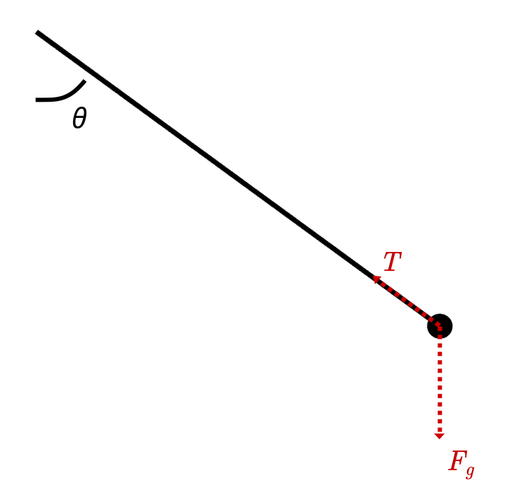

---

Nggak kerasa sebentar lagi 2024. Baru aja kemarin selesai bikin resolusi tahun baru, eh, sekarang ngesiapin resolusi baru lagi nih.

Kayaknya memang menjaga jalannya alur waktu itu sulit ya buat kita di era digital yang bergerak begitu pesat ini.

Terlepas dari itu semua, disini aku ingin menenangkan kekhawatiran kalian bahwa memang sepanjang sejarah manusia, semua telah susah payah bergelut menjaga waktu. Oleh karena itu aku memulai series ini "Demi Waktu".

Disini aku ingin memulai dengan salah satu penjaga waktu kita yang klasik, **bandul**.

---

# Dimulai dari Abad Pej(el)ajahan

Untuk melihat awal mula penggunaan bandul, aku ingin membawa kalian kembali ke abad ke-$`17`$. Kita sekarang berada di Abad Penjelajahan, ribuan kapal meninggalkan pelabuhan Eropa demi mencari jalur-jalur perdagangan baru.

Menelusuri bumi di abad ini sayangnya nggak mudah, peta dunia aja masih belum lengkap, apalagi GPS atau Google Map.

Bayangin aja, kamu ditelantarin di tengah laut tanpa peta, landmark, ataupun petunjuk apapun di sepanjang cakrawala. Jadi sangat krusial buat kita untuk mengetahui posisi kita biar nggak gampang nyasar.

## Navigasi Langit

Salah satu cara untuk melakukan itu adalah dengan menggunakan bintang, untuk menentukan garis lintang dan garis bujur.

Biasanya untuk **garis lintang**, kita bisa menentukannya dari posisi tertinggi matahari relatif ke garis ufuk. Semakin tinggi posisi matahari, semakin dekat kita ke garis khatulistiwa.

Di malam hari, kita juga bisa mengukur posisi garis lintang menggunakan posisi bintang. Contohnya, kalo kita berada di belahan utara Bumi, kita bisa menggunakan bintang Polaris, yang terletak persis di garis sumbu rotasi Bumi. Kebalikan dengan matahari, semakin tinggi posisi Polaris, semakin jauh kita dari garis khatulistiwa.

Dengan penjabaran trigonometri diatas, kita bisa menemukan posisi garis lintang dari ketinggian bintang Polaris dengan rumus

$$
\tan{\theta_{\text{g-l}}}=\frac{d_\text{langit}}{d_\text{ufuk}}.
$$

Nah... kalo **garis bujur** beda lagi caranya. Disini kita bisa lihat pergantian posisi sudut bintang di waktu yang sama. Jumlah pergantian posisi sudut di bintang $\Delta\theta$ tersebut sesuai dengan jumlah perubahan garis bujur atau **garis bujur relatif** yang kita tempuh $-\Delta\theta$, seperti yang ada di gambar berikut:

Sayangnya, kalkulasinya biasanya kurang akurat karena sewaktu itu biasanya menggunakan tabel waktu berdasarkan posisi Polaris dan matematikanya pun terlalu rumit untuk pelaut pada umumnya [^1].

Oleh karena itu, dibutuhkanlah cara untuk mencari posisi garis bujur secara simpel dan akurat.

## Menerka Ruang Melalui Waktu

Jadi gimana cara kita menghitung garis bujur dengan simpel dan akurat? Kita lakukan itu dengan jam. Dengan memiliki jam di kapalmu, nggak hanya kamu bisa mengukur garis bujur relatif tanpa harus menggunakan tabel waktu dan Polaris, tapi kamu juga bisa menghitung betul posisi absolut garis bujur.

Ini bisa dilakukan menggunakan jam. Dengan membawa jam yang memantau waktu pada tempat asalmu, kamu bisa melihat berapa perbedaan waktu pada waktu lokal dan waktu di tempat asalmu. Disini, kita bisa menggunakan titik tertinggi matahari sebagai patokan jam $12$ waktu lokal contohnya.

Karna kita tau bahwa satu kali rotasi bumi itu sama dengan $24$ jam, kita jadinya tau berapa perubahan garis bujur yang telah kita tempuh dengan pergantian waktu yang kita alami.

Contohnya, kalau seharusnya kita tau bahwa waktu lokal seharusnya jam $12.00$, dan ternyata jam yang kita bawa menunjukan jam $15.00$, berarti kita $3$ jam lebih telat dan telah bergerak ke barat sepanjang $\frac{3}{24}$ dari lingkar bumi.

Thanks to imperialism, kita bisa menghitung posisi **garis bujur absolut $\theta_\text{g-b}$** menggunakan waktu jam Greenwich $T_\text{GMT}$ (GMT +00) saat matahari berada di titik tertinggi,

$$
\theta_\text{g-b}=\frac{180^\circ}{12}(12.00-T_\text{GMT}).
$$

Terus apa yang menghentikan orang pada abad Penjelejahan untuk menggunakan metode diatas? Well, kita waktu dulu belum mempunyai jam kapal yang bisa menghitung detik secara akurat.

Jam sebenarnya memang sudah ada dari dulu. Jam matahari menggunakan posisi bayangan matahari, tapi nggak bisa dipindahin. Jam pasir bisa dibawa kemana-mana, tapi kurang akurat. Jam air bisa akurat, tapi nggak praktis untuk dibawa di kapal.

Saking pentingnya mempunyai jam yang akurat, Dewan Negara Belanda (setara dengan DPR-nya Indonesia) menjanjikan bayaran sebesar 10000 florins pada tahun 1627 [^2], atau setara dengan 9 milyar rupiah!

Dengan upah yang begitu menggiurkan, banyak saintis tergoda untuk memecahkan masalah ini, termasuk sang "bapak metode ilmiah dan ilmu fisika modern", Galileo.

# Bandul

Sebelum masanya Galileo, aku ingin mengejutkan kalian dengan fakta bahwa penggunaan bandul bukan sesuatu yang umum. Fakta bahwa sebuah masa yang diikat ke tali dan dibiarkan bergerak tidak mempunyai manfaat atau kegunaan sesekalipun.

Studi yang melibatkan bandul baru dimulai oleh Nicole Oresme pada tahun 1350, yang mendeskripsikan bahwa setiap benda memiliki sebuah **impetus** atau "dorongan". Dia menunjukan bahwa kalo kita mengikat sebuah masa dengan tali, dan menjatuhkannya dari titik yang tinggi, masa itu akan mendapatkan sebuah dorongan untuk naik lagi keatas.

Bahkan Oresme berpostulasi bahwa, kalo kita menjatuhkan sebuah masa ke lubang yang menembus bumi, masa tersebut akan melewati pusat bumi dan berhenti sedekat lebih pendek dari permukaan bumi. Masa tersebut kemudian akan jatuh lagi ke bawah menembus bumi dan keluar sedikit lebih pendek lagi dari tinggi lubang tempat kita menjatuhkan masa tersebut. Pada akhirnya, Oresme menyimpulkan bahwa masa tersebut akan kehilangan "dorongan" dan berhenti di pusat bumi [^3].

_Gedankenexperiment_ (kata Jerman dari eksperimen pikiran) diatas adalah deskripsi awal dari **gerakan osilasi**, atau gerakan berayun-ayun, yang menjadi ciri khas dari sebuah bandul.

## Sebuah Revisi Fisika

Tentu saja sekarang sudah mengenal pergerakan osilasi yang disebut oleh Oresme sebagai bukti dari **hukum gerak Newton ke-2** dan **hukum kekekalan energi**, namun perlu diingat bahwa hukum-hukum gerak Newton, baru hanya akan dinyatakan di Principia Mathematica yang diterbitkan tahun 1687.

Terlepas dari itu, apa sih memang fisika dibalik sebuah bandul?

> **Reminder:** Untuk ngingetin, bahwa **Hukum gerak ke-2 Newton** berkata _"pergantian momentum di sebuah benda berbanding lurus dengan total gaya yang diberikan di sebuah benda, $\sum\vec F=\frac{d\vec p}{dt}$"_, dan **hukum kekekalan energi** berkata _"energi tidak bisa dibuat atau dihancurkan, hanya diubah dari satu ke bentuk yang lain, $\sum E =\sum E'$"_.

Well, pertama-tama impetus atau dorongan yang dicanangkan oleh Oresme tidak lain adalah **momentum**. Ketika bandul dilepas dalam keadaan diam, bandul tersebut tidak mempunyai momentum. Namun karena ada gaya, bandul tersebut mengumpulkan momentum dan bergerak lagi keatas.

Gaya yang memicu pergantian momentum adalah gaya tarikan $\vec T$ dan gaya gravitasi $\vec F_g$, yang berarti

$$
\vec T+\vec F_g = \frac{d\vec p}{dt}
$$

Di arah **radial $\vec e_r$** (yang berarah berlawanan dengan gaya tarikan), kita punya gaya tarikan $\vec T$ yang mampu menyesuaikan ukurannya dengan kecepatan benda dan gaya gravitasi radial $\vec F_{g,r}$ sehingga jumlahnya memberikan pergerakan lingkaran (gaya sentripetal)

$$
\vec T + \vec F_{g,r}=(T+mg\cos\theta)\vec e_r= \frac {d\vec p_r}{dt} =\vec F_{cp}=-\frac{mv²}{r}\vec e_r.
$$

Jadi kita tersisa dengan arah **tangensial $\vec e_t$** (yang searah dengan pergerakan masa bandul). Kita tahu bahwa kalau panjang dari bandul adalah $l$, posisi masa bandul adalah $l\theta$. Terlebih lagi, karena tidak ada pergerakan radial, kita bisa dengan mudah berasumsi bahwa semua percepatan hanya mengubah posisi sudut $\theta$,

$$
\vec F_{g,t}=mg\sin\theta\vec e_t=\frac{d\vec p_t}{dt}=m\frac{d\vec v_t}{dt}=ml\frac{d²}{dt²}(\theta )\vec e_t
$$

## Isokroni

## Sikloid

# Referensi

[^1]: N Bowditch, _The American Practical Navigator_, Bicentennial edn, National Imagery and Mapping Agency, Maryland, 2002, p. 6
[^2]: H Aldersey-Willias, _Dutch Light: Christian Huygens and the Making of Science in Europe_, Picador, London, 2020, p. 114
[^3]: B S Hall "The scholastic pendulum", _Annals of Science_, vol. 35, no. 5, p. 441-462
